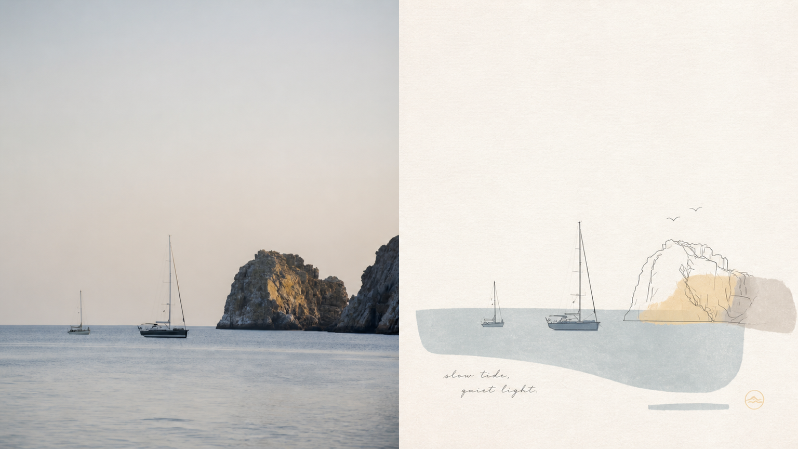
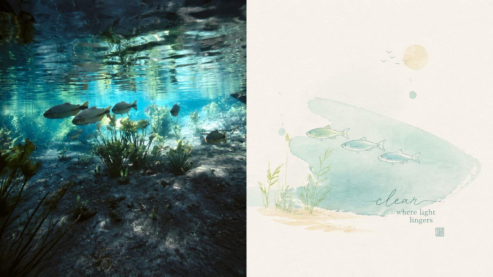
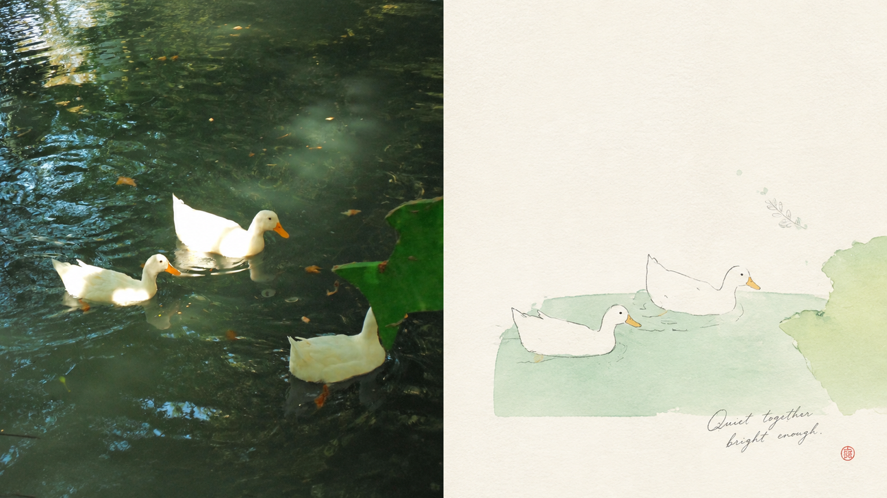
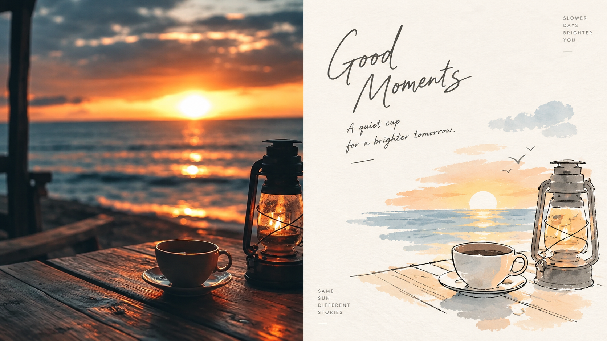
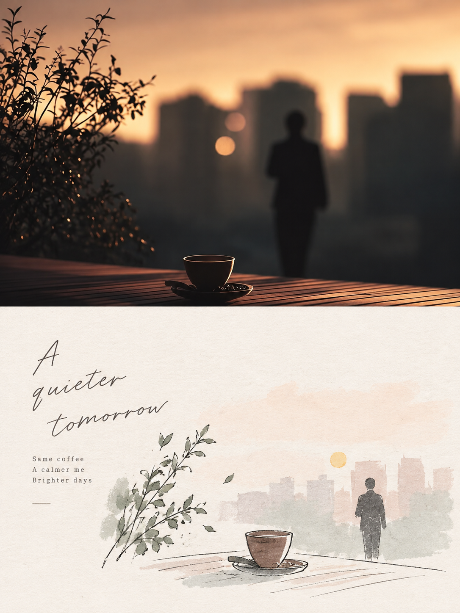
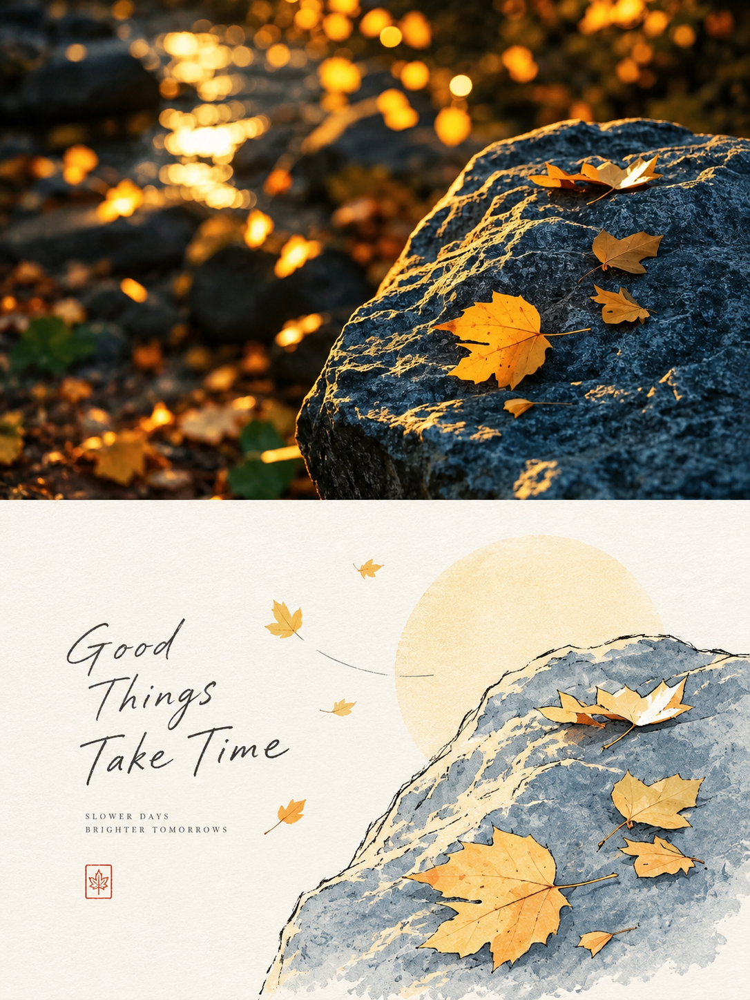
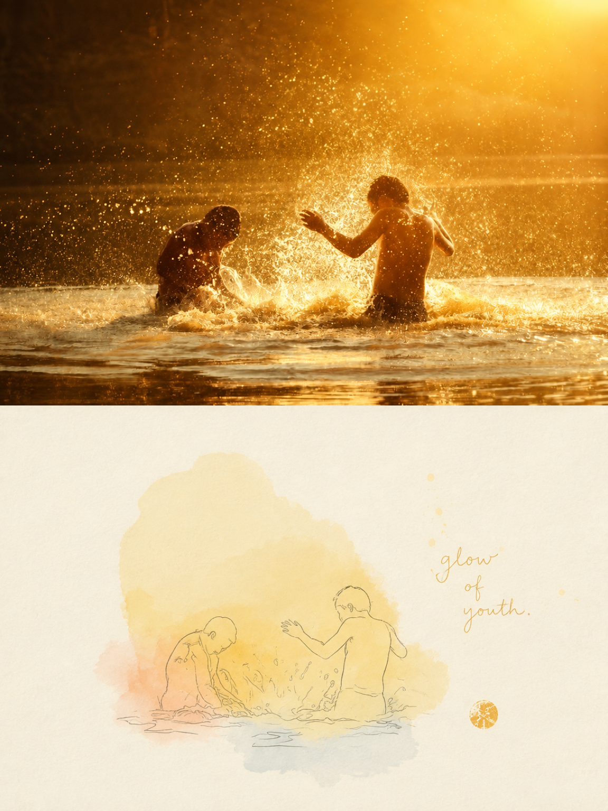
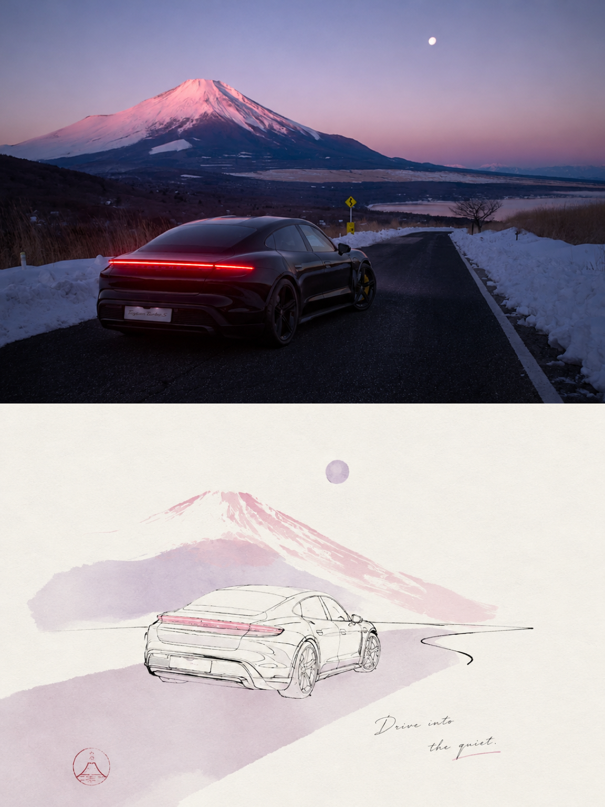

<div align="center">

# XXD Panel 117｜Fine-Line Pastel Whitespace Chronicle

One visual anchor, a newly directed subject, and whitespace with purpose.

<a href="README.md">简体中文</a> · <strong>English</strong> · <a href="README.ja.md">日本語</a> · <a href="README.ko.md">한국어</a> · <a href="README.ar.md">العربية</a>

</div>

## Sample works

本项目已发布 8 张实际样片，图片文件位于 `assets/examples/`。

| sample-05 | sample-07 | sample-09 | sample-11 |
| --- | --- | --- | --- |
|  |  |
| sample-07 | sample-08 |
|  |  |
| sample-09 | sample-10 |
|  |  |
| sample-11 | sample-12 |
|  |  |

## Best-fit situations and problems solved

When a photograph is cluttered or ordinarily composed yet contains something worth preserving, **Panel 117** identifies one core theme, one visual anchor and one emotional relationship, then redirects them into a small composition of fine lines, pale flat colour, paper texture and light collage. The photograph can remain in the comparison region while intentional whitespace gives the design its own expression.

### Best for

- Preserving recognition while redesigning subject position, scale, direction and cropping.
- Replacing object-by-object tracing and cluttered backgrounds with few elements and a strong theme.
- Fine lines, gentle pastels and breathable paper rather than realistic details or smooth vectors.
- Consistent top-bottom, left-right, design-only, multi-ratio, four-device wallpaper and directory-batch delivery.

### What it solves

- Selects the essential visual anchor from complex material and removes secondary information.
- Makes whitespace organise positive/negative shapes, distance and asymmetric balance.
- Keeps comparisons to exactly two 50:50 regions with no third band or inset.
- Generates each output independently in one pass from its current original, avoiding repeated stylisation.

## Original prompt · five languages

[简体中文](references/original-prompt/zh-CN.md) · [English](references/original-prompt/en.md) · [日本語](references/original-prompt/ja.md) · [한국어](references/original-prompt/ko.md) · [العربية](references/original-prompt/ar.md)

The Chinese file preserves the user's original verbatim and is the sole runtime creative and aesthetic authority. The other four languages are complete faithful reading translations. For explicitly selected non-default modes such as left-right, the adapter maps only delivery position and dimensions; the aesthetic remains unchanged.

**Signature:** one core theme · one visual anchor · one emotional relationship · fine hand drawing · pale flat colour · paper texture · light collage · stamp-scale subject · 2–4 colours · extensive whitespace · fine handwritten type

## Quick fit check

| What you need to know | What Panel 117 gives you |
|---|---|
| Can an ordinary composition work? | Subject size, position, direction and crop can be redesigned after distillation. |
| Will the source remain recognisable? | Its most representative contours, movement, pose and visual memories remain. |
| Is whitespace merely unfinished space? | It clearly exceeds the drawn area and actively organises distance and positive/negative shapes. |
| Flexible delivery sizes? | Common ratios, exact pixels, four modes and directory batches are supported. |

## Transformation logic

```text
identify one theme, anchor and emotional relationship → remove the rest → redesign scale, position and crop → reconstruct with fine lines and pale flat colour → organise paper, pale colour blocks and light collage → finish with broad whitespace and sparse handwritten wording
```

## Recognisable finished traits

- A few simple fine outlines identify the subject, with very few essential interior lines.
- Light, calm flat areas replace realistic detail; an optional pale theme-colour block supports a subject that may cross its edge.
- A small stamp-scale subject may be off-centre, edge-adjacent, suspended or cropped; whitespace clearly exceeds the drawn area.
- 2–4 source colours become high-value, clear, gentle pastels with readable contrast against near-white paper.
- Very few theme- or mood-derived symbols take one or two strokes, without copying real objects or decorating gaps.
- Sparse words arise from the subject, action, emotion, memory or metaphor and enter the whitespace in fine, natural, slightly handwritten type.

## Four output modes

- `top-bottom`: exactly two full-width regions, reality above and design below, 50% each.
- `left-right`: exactly two full-height regions, reality left and design right, 50% each; it never rotates into a top-bottom layout.
- `design-only`: the full canvas contains only Panel 117's designed translation; the photograph remains a non-visible reference.
- `wallpaper-pack`: creates complete artworks for phone, iPad, desktop, and watch, either `linked` as a coherent family or `independent` as four separate works.

Modes and sizes may be combined. Supported sizes include `1:1`, `3:4`, `4:3`, `4:5`, `5:4`, `2:3`, `3:2`, `9:16`, `16:9`, `21:9`, `5:7`, `7:5`, and exact pixels. Text can be prompt-generated, user-exact, or absent. A directory is inventoried recursively and every source is isolated while sharing one set of delivery settings; final PNG files remain flat in one fresh task directory.

## Getting started

```bash
git clone https://github.com/nevertoday/xxd-panel-117.git
npx skills add https://github.com/nevertoday/xxd-panel-117 --skill xxd-panel-117
```

Restart the agent session after installation, then invoke `$xxd-panel-117`. Add `--global --agent codex --yes` when a user-level Codex installation is wanted.

Common examples:

```text
/xxd-panel-117 photo.jpg --mode top-bottom --size 3:4 --text prompt --locale en-US
/xxd-panel-117 photo.jpg --mode left-right --size 16:9 --text prompt --locale en-US
/xxd-panel-117 photo.jpg --mode design-only --size 9:16 --text none
/xxd-panel-117 ./photos --mode design-only --size auto,3:4 --text prompt --locale ja-JP
```

See [SKILL.md](SKILL.md) for the full runtime contract and the [English](references/xxd-panel-117-prompt.en.md) or [Chinese](references/xxd-panel-117-prompt.zh-CN.md) runtime adapter.

<!-- xxd-readme-ads:start -->
## About XXD

XXD is Xiaoxiaodong's abbreviated brand name. Created and maintained by [@xiaoxiaodong01](https://x.com/xiaoxiaodong01).

## Support and membership

> **Advertising disclosure:** QR codes and paid membership/service links in this section are XXD promotional content. Scanning or purchasing is optional and does not affect access to this open-source project.


<!-- xxd-panel-command-system:start -->

All General Skills are included in the CNY 699/year membership; no separate purchase is required.

| Level | Skill | Responsibility |
|---|---|---|
| **General** | [`xxd-panel-all`](https://github.com/xiaoxiaodong-ai/xxd-panel-all) | Detect available numbered Skills; recommend by image, theme, or use; dispatch a chosen number; organize multi-style trials; and assign folders of images to individual jobs. |
| **Soldiers** | `xxd-panel-NNN` | Each numbered Skill executes only its own original brief and aesthetic, completing the individual job assigned by the General. |

<!-- xxd-panel-command-system:end -->

### Knowledge Planet + Member Prompt Library + All General Skills Membership · CNY 699/year

[Knowledge Planet](https://wx.zsxq.com/group/15554814142882), the [XXD Member Prompt Library](https://vip.xiaoxiaodong.ai/), and membership for all General Skills are one membership: **one annual payment unlocks all three benefits, with no second purchase required.**

[Knowledge Planet](https://wx.zsxq.com/group/15554814142882) · [Member Prompt Library](https://vip.xiaoxiaodong.ai/)

<p align="center"><a href="https://xiaoxiaodong.pages.dev/assets/wechat-qr.png"></a></p>
<!-- xxd-readme-ads:end -->

## License

This project—including the Skill, prompts, scripts, documentation, and accompanying sample images—is licensed under the **PolyForm Noncommercial License 1.0.0**. See [LICENSE](LICENSE) for the full legal text and <https://polyformproject.org/licenses/noncommercial/1.0.0> for the official page.

In plain language:

- Individuals may use it for study, research, experimentation, testing, hobby projects, and private entertainment. Charities, educational institutions, public research, safety or health organisations, environmental organisations, and government institutions may also use it.
- For **noncommercial purposes**, you may use, copy, modify, create derivative works, and share it. When sharing, you must also provide this license (or the link above) and every `Required Notice:` statement supplied by the author.
- It may not be used in commercial products or services, paid delivery, sale of access or licences, or any use expected to lead to commercial application. Obtain separate written permission from the copyright holder before commercial use.
- The agreement grants only the copyright licence and limited patent licence expressly stated. It grants no trademarks, brand names, or other unstated rights, and you may not sublicense your licence to others.
- After written notice of a violation, you must return to compliance and take practical remedial steps within 32 days, or the licences terminate immediately. A written patent-infringement claim also terminates the patent licence.
- The material is provided “as is”, without warranty to the extent permitted by law. Users bear the risks and potential losses arising from its use.
